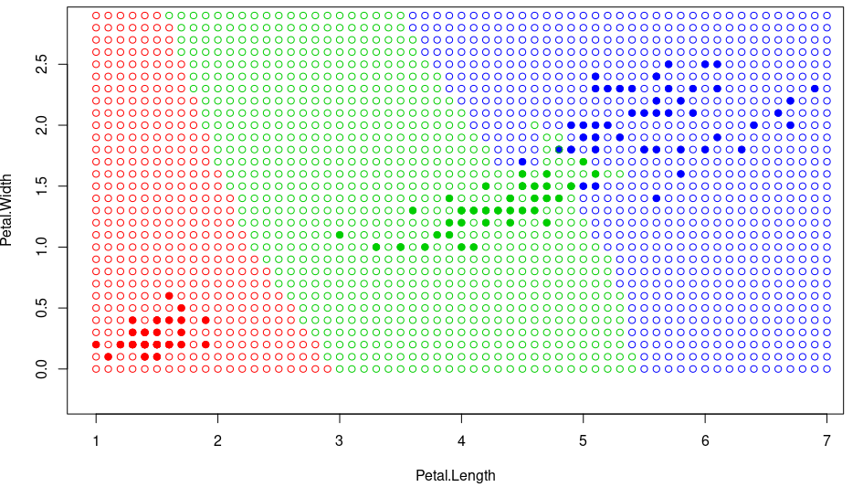

# 1NN

1NN (алгоритм ближайшего соседа) – относит классифицируемый объект u ∈ X к тому классу, которому принадлежит его ближайший сосед:


### Программная реализация на языке R

```R
NN <- function(xl, z) {
  orderedXl <- sortObjectsByDist(xl, z)
  n <- dim(orderedXl)[2] - 1
  classes <- orderedXl[1, n + 1]
  return (classes)
}
```

### Работа 1NN на выборке ирисов Фишера


### Карта классификации для 1NN
<br/><br/>



Преимущество:
<ul>
<li>простота реализации</li>
</ul>

Недостатки:
<ul>
<li>неустойчивость к погрешностям — выбросам</li>
<li>отсутствие параметров, которые можно было бы настраивать по выборке. Алгоритм полностью зависит от того, насколько удачно выбранаметрика ρ</li>
<li>низкое качество классификации</li>
</ul>

<a href="https://github.com/davilexx/ml1">На главную</a>
