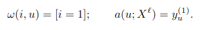
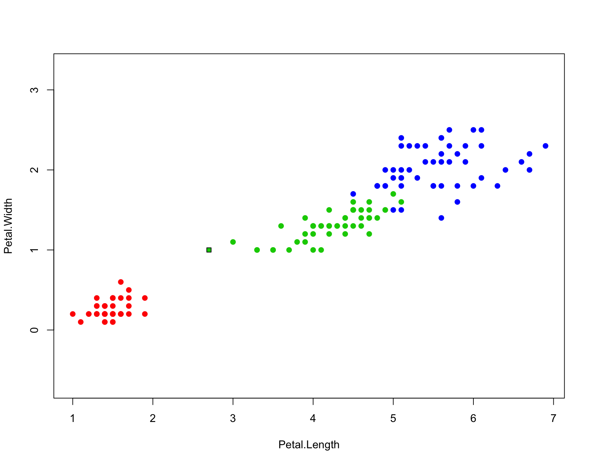

# 1NN

<b>Алгоритм ближайшего соседа (1NN)</b> – относит классифицируемый объект u ∈ X к тому классу, которому принадлежит его ближайший сосед:



### Реализация на языке R

```R
## параметрами функции являются входной объект и выборка
NN <- function(xl, z) {
  
  ## cортировка выборки
  orderedXl <- sortObjectsByDist(xl, z)
  n <- dim(orderedXl)[2] - 1
  
  ## выбор ближайшего класса
  classes <- orderedXl[1, n + 1]
  return (classes)
}
```

### Карта классификации для 1NN



Преимущество:
<ul>
<li>простота реализации</li>
</ul>

Недостатки:
<ul>
<li>неустойчивость к погрешностям — выбросам</li>
<li>отсутствие параметров, которые можно было бы настраивать по выборке. Алгоритм полностью зависит от того, насколько удачно выбранаметрика ρ</li>
<li>низкое качество классификации</li>
</ul>
