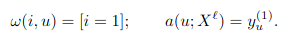
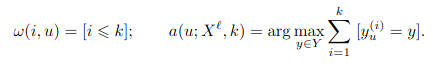

# 1NN

<b>Алгоритм ближайшего соседа (1NN)</b> – относит классифицируемый объект u ∈ X к тому классу, которому принадлежит его ближайший сосед:



Преимущество
- Простота реализации.

Недостатки
- Неустойчивость к погрешностям - выбросам.
- Отсутствие параметров, которые можно было бы настраивать по вы-борке. Алгоритм полностью зависит от того, насколько удачно выбранаметрика ρ.
- Низкое качество классификации.

# kNN

<b>kNN (k Nearest Neighbor или k Ближайших Соседей)</b> — это один из самых простых алгоритмов классификации, также иногда используемый в задачах регрессии. Благодаря своей простоте, он является хорошим примером, с которого можно начать знакомство с областью Machine Learning.

<b>Алгоритм</b>

Для классификации каждого из объектов тестовой выборки необходимо последовательно выполнить следующие операции:

<ul>
  <li>Вычислить расстояние до каждого из объектов обучающей выборки</li>
  <li>Отобрать k объектов обучающей выборки, расстояние до которых минимально</li>
  <li>Класс классифицируемого объекта — это класс, наиболее часто встречающийся среди k ближайших соседей</li>
</ul>

  
 
<p>Пример классификации k-ближайших соседей. Тестовый образец (зелёный круг) должен быть классифицирован как синий квадрат (класс 1) или как красный треугольник (класс 2). Если k = 3, то он классифицируется как 2-й класс, потому что внутри меньшего круга 2 треугольника и только 1 квадрат. Если k = 5, то он будет классифицирован как 1-й класс (3 квадрата против 2 треугольников внутри большего круга)</p>

kNN относит объект u к тому классу, элементов которого больше среди k ближайших соседей:



<h2> Программная реализация на языке R </h2>

В качестве функции расстояния будем использовать обычное расстояние

```R
euclideanDistance <-function(u, v) 
{
  sqrt(sum((u - v) ^ 2))
}
```

Сортируем объекты согласно расстояния до объекта z, создав матрицу расстояний

```R
sortObjectsByDist <- function(xl, z, metricFunction = euclideanDistance)
{
  l <-dim(xl)[1]
  n <-dim(xl)[2] - 1
  
  distances <- matrix(NA, l, 2)
  
  for (i in 1:l) 
  {
    distances[i, ] <- c(i,metricFunction(xl[i, 1:n], z))
  }
  
  orderedXl <- xl[order(distances[, 2]), ]
  return (orderedXl);
}
```
