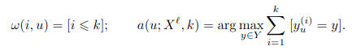
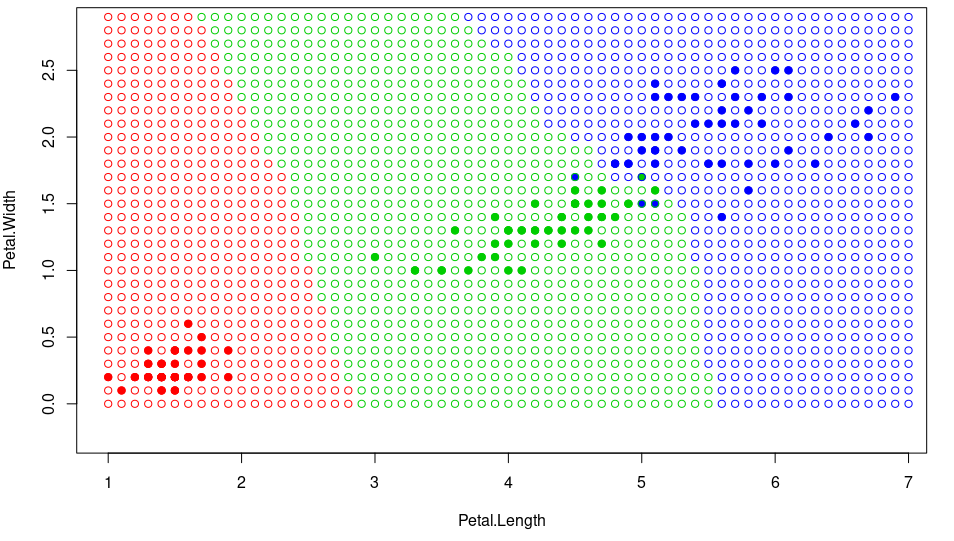

# kNN

kNN относит объект u к тому классу, элементов которого больше среди k ближайших соседей:



### Программная реализация на языке R

```R
## применяем метод kNN
kNN <- function(xl, z, k) {
  ## сортируем выборку согласно классифицируемого объекта
  orderedXl <- sortObjectsByDist(xl, z)
  n <- dim(orderedXl)[2] - 1
  ## получаем классы первых k соседей
  classes <- orderedXl[1:k, n + 1]
  ## составляем таблицу встречаемости каждого класса
  counts <- table(classes)
  ## находим класс, который доминирует среди первых k
  class <- names(which.max(counts))
  return (class)
}
```

После завершения алгоритма LOO получим оптимальное k = 6.

### Карта классификации для kNN
<br/><br/>



Преимущества:
<ul>
<li>простота реализации</li>
<li>при правильном подборе k будет хорошее качество классификации</li>
</ul>

Недостатки:
<ul>
<li>мало параметров</li>
<li>требуется хранить полную выборку</li>
<li>качество алгоритма сильно зависит от выбранной метрики</li>
</ul>

<a href="https://github.com/davilexx/ml1">На главную</a>
