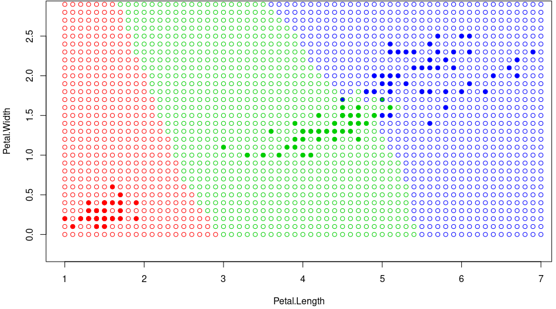

# kWNN

Данный метод схож с kNN, за исключением того, что здесь добавляется весовая функция, которая будет оценивать степень важности i-го соседа для классификации объекта z.

### Программная реализация на языке R

```R
weight <- function(i, k, q) {
  return (q ^ i)
}

kWNN <- function(xl, z, k, q) {
  orderedXl <- sortObjectsByDist(xl, z)
  n <- dim(orderedXl)[2] - 1
  weights <- rep(0,3)
  names(weights) <- c("setosa", "versicolor", "virginica")
  classes <- orderedXl[1:k, n + 1]
  for(i in 1:k) {
    weights[classes[i]] <- weight(i,k,q) + weights[classes[i]];
  }
  class <- names(which.max(weights))
  return(class)
}
```

### Карта классификации для kWNN
<br/>
<br/>



Преимущества:
<ul>
  <li>простота реализации</li>
  <li>при правильном подборе k и q будет хорошее качество классификации</li>
</ul>

Недостатки:
<ul>
  <li>качество алгоритма сильно зависит от выбранной метрики</li>
  <li>требуется хранить полную выборку</li>
</ul>

<a href="https://github.com/davilexx/ml1">На главную</a>
