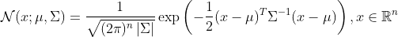
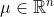
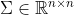
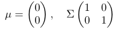
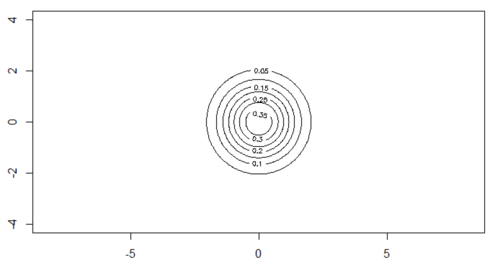
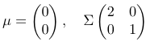
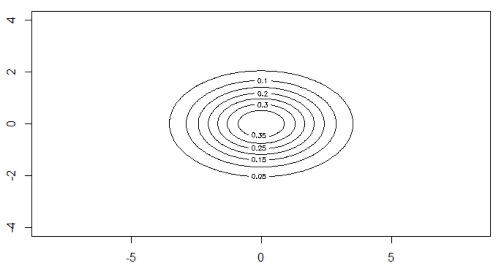
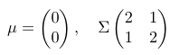
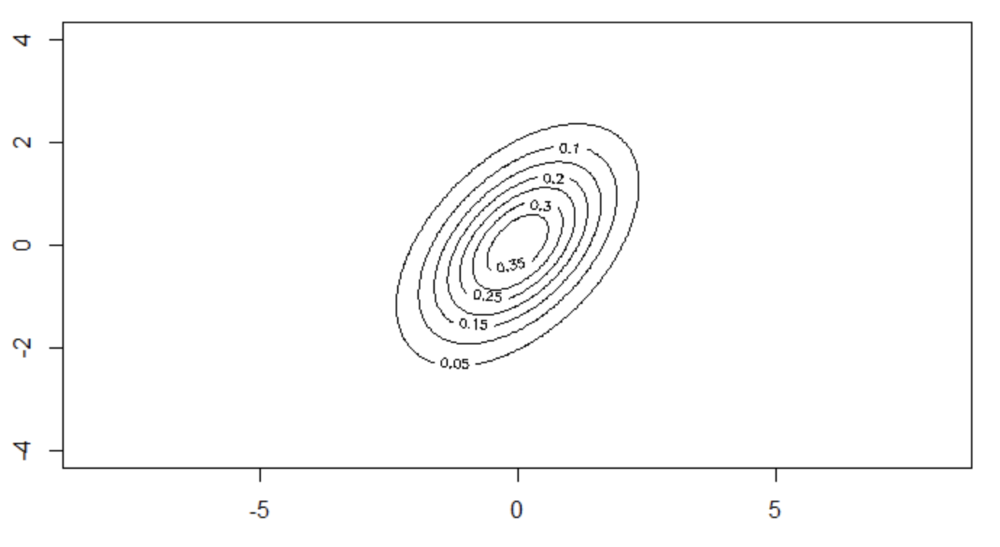

# Линии уровня нормального распределения

Линией уровня функции двух переменных называется множество точек на координатной плоскости, в которых функция принимает одинаковые значения. Необходимо построить линии уровня нормального распределения, когда даны ковариационная матрица нормального распределения и математическое ожидание.

n-мерное нормальное (гауссовское) распределение:
<br/>
,
<br/>
где  — матожидание, а  — ковариационная марица.

<a href="https://imgur.com/a/vUIZzpK">Вывод формул</a>

### Программная реализация на языке R
```R

## покажем на графике линии уровня нормального распределения и рассчитаем плотность
## формула: Ax^2 + Bxy + Cy^2 + Dx + Ey + F = 0
lines_draw = function(mu, cov, title) {  
    det = det(cov)
    a = cov[1,1]
    b = cov[1,2]
    c = cov[2,1]
    d = cov[2,2]
    mu1 = mu[1]
    mu2 = mu[2]
    ## перемножаем векторы и обратную матрицу
    A = d / det
    B = (-b-c) / det
    C = a / det
    D = (-2 * d * mu1 + b * mu2 + c * mu2) / det
    E = (b * mu1 + c * mu1 - 2 * a * mu2) / det
    f = (d * mu1 * mu1 - b * mu1 * mu2 - c * mu1 * mu2 + a * mu2 * mu2) / det
    
    x = y = seq(-4, 4, 0.04 )
    
    ## рассчитаем коэффициенты уравнения кривой второго порядка
    z = outer(x, y, function(x, y) 1 / sqrt(2 * pi * d) * exp(-1 / 2 * (A * x * x + B * y * x + C * y * y + D * x + E * y + f)))
    
    contour(x, y, z, levels = seq(0, 1, 0.05), main = title, drawlabels = T, asp = 1) 
  }

##
lines_draw(c(0,0), matrix(c(1,0,0,1), nrow = 2, ncol = 2),  title = "Признаки некоррелированы и имеют одинаковые дисперсии")
#lines_draw(c(0,0), matrix(c(1,0,0,3), nrow = 2, ncol = 2),  title = "Признаки некоррелированы и имеют разные дисперсии")
#lines_draw(c(0,0), matrix(c(1,1,0,1), nrow = 2, ncol = 2),  title = "Признаки коррелированы и имеют разные дисперсии")
```

### Признаки некоррелированы, одинаковые дисперсии




### Признаки некоррелированы, разные дисперсии




### Признаки коррелированы, разные дисперсии




<a href="https://github.com/davilexx/ml1">На главную</a>
