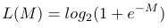
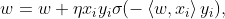
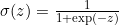
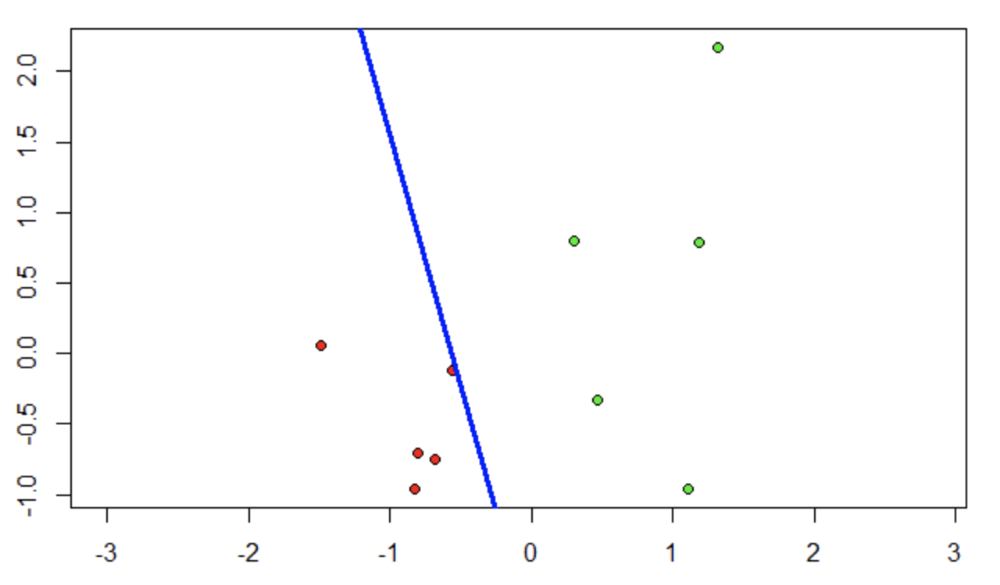
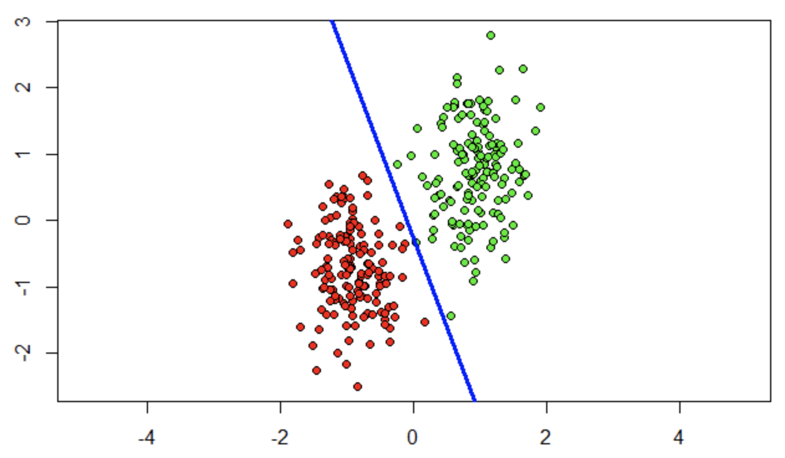
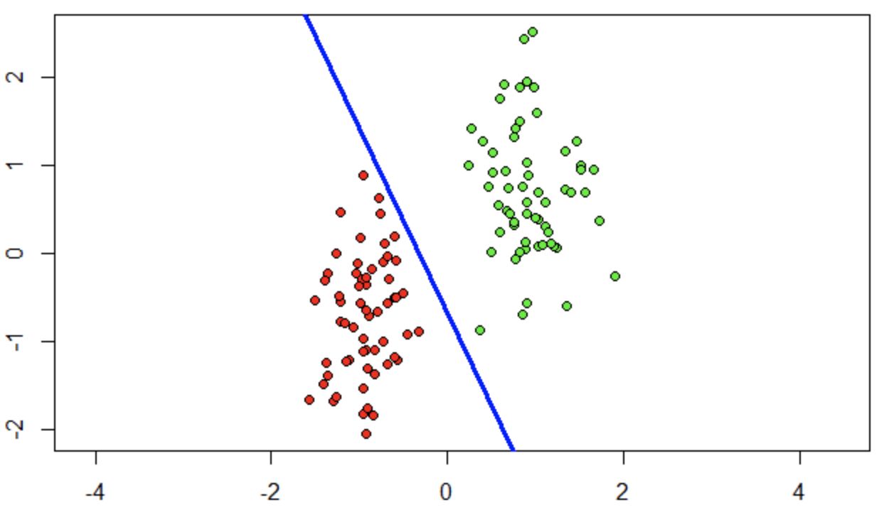
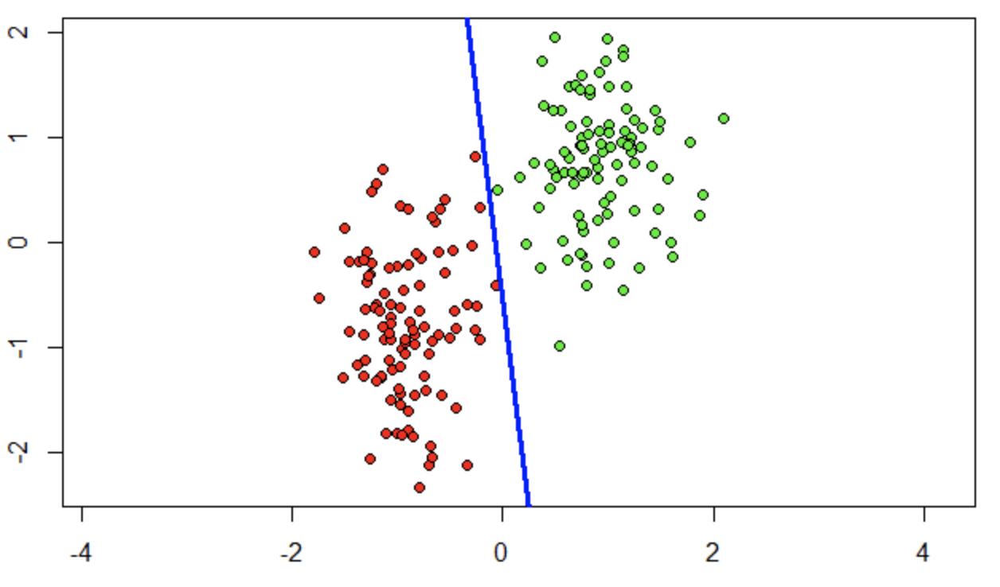

# Логистическая регрессия

В логистической регрессии для настройки вектора весов необходимо решить задачу минимизации эмпирического риска с функцией потерь: <br/>


Правило обновления весов: <br/>
,
где  — сигмоидная функция.

Обучение будет происходить с помощью метода стохастического градиента. Суть метода заключается в поиске вектора параметров w, при котором достигается минимум эмпирического риска. Алгоритм метода градиентного спуска таков: сначала выбирается приближённое значение для вектора параметров w, после чего запускается итерационный процесс, на каждом шаге которого будет произведёт сдвиг в сторону, противоположную вектора градиента до тех пор, пока вектор весов не перестанет изменяться.


### Программная реализация на языке R

```R
loss <- function(x)
{
  return (log2(1 + exp(-x)))
}
sigmoid <- function(z)
{
  return (1 / (1 + exp(-z)))
}
 l <- dim(xl)[1]
  n <- dim(xl)[2] - 1
  w <- c(1/2, 1/2, 1/2)
  iterCount <- 0
  Q <- 0
  for (i in 1:l) {
    wx <- sum(w * xl[i, 1:n])
    margin <- wx * xl[i, n + 1]
    Q <- Q + loss(margin)
  }
  repeat {
    margins <- array(dim = l)
    for (i in 1:l)
    {
      xi <- xl[i, 1:n]
      yi <- xl[i, n + 1]
      margins[i] <- crossprod(w, xi) * yi 
    }
    errorIndexes <- which(margins <= 0) 
    if (length(errorIndexes) > 0)
    {
      i <- sample(1:l, 1)
      iterCount <- iterCount + 1
      xi <- xl[i, 1:n]
      yi <- xl[i, n + 1]
      wx <- crossprod(w, xi)
      margin <- wx * yi
      ex <- loss(margin)
      w <- w + eta * xi * yi * sigmoid(-wx * yi) 
      Qprev <- Q
      Q <- (1 - lambda) * Q + lambda * ex 
    } else
    {
      break
    }
  }
  return(w)
```
### Примеры работы логистической регрессии

<table width="100%">
  <tr>
    <td></td>
    <td></td>
  </tr>
  <tr></tr>
  <tr>
    <td></td>
    <td></td>
  </tr>
</table>

<a href="https://github.com/davilexx/ml1">На главную</a>
