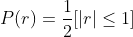
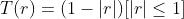
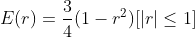
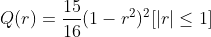
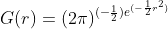

# Метод парзеновского окна

В данном методе мы будем присваивать вес каждому объекту на основе расстояния от элемента, который мы классифицируем, до элемента из выборки. Классифицируемый объект будет иметь некоторую окрестность с радиусом h. Для каждого объекта и выборки считается отношение расстояние до входного объекта и радиуса окна. Далее вызывается ядерная функция, которая вычисляет вес опираясь на значение отношения.

Существует 5 ядер:

Прямоугольное ядро: <br>
Треугольное ядро: <br>
Ядро Епанечникова: <br>
Квартическое ядро: <br>
Гауссовское ядро: <br>

Явным недостатком первых четырех ядер в том, что они не могут классифицировать точки, которые не попали в окно входного объекта. Гауссовское ядро решает эту проблему.

### Программная реализация на языке R

```R
euclideanDistance <- function(u,v) {
  sqrt(sum((u - v)^2))
}

Rect <- function(r) {
  (abs(r) <= 1) * 0.5
}

Tria <- function(r) {
  (abs(r) <= 1) * (1 - abs(r))
}

Epan <- function(r) {
  (abs(r) <= 1) * (1 - r^2)
}

Quar <- function(r) {
  (abs(r) <= 1) * (1 - r^2)^2
}

Gaus <- function(r) {
  dnorm(r)
}

parsen <- function(x, z, h, F) {
  m <- dim(x)[1]
  n <- dim(x)[2]-1
  classes <- rep(0, length(names(table(x[,n+1]))))
  names(classes) <- names(table(x[,n+1]))
  for(i in 1:m){
    y <- x[i, n+1]
    dist <- euclideanDistance(x[i,1:n],z)
    w <- F(dist/h)
    classes[y] <- classes[y] + w
  }
  if(sum(classes) > 0) {
    class <- names(which.max(classes))
  } else {
    class <- "unknown"
  }
  return(class)
}
```

<a href="https://github.com/davilexx/ml1">На главную</a>
