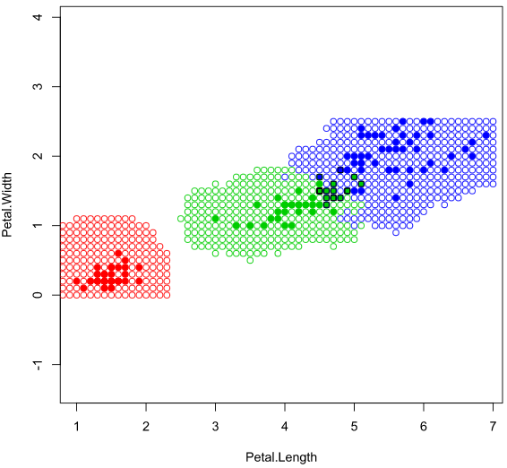
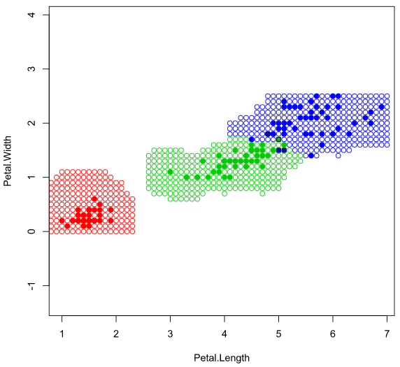
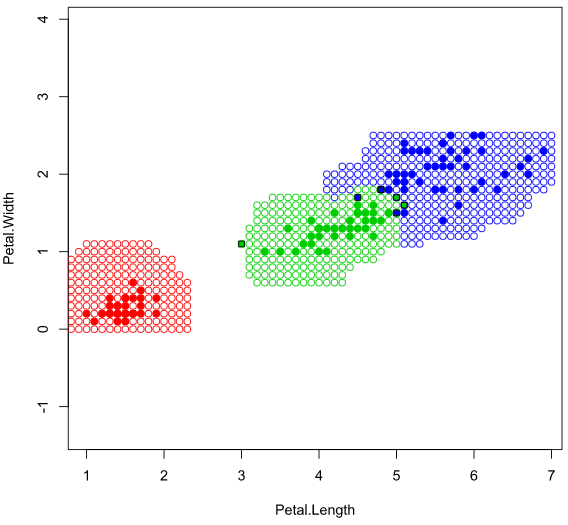
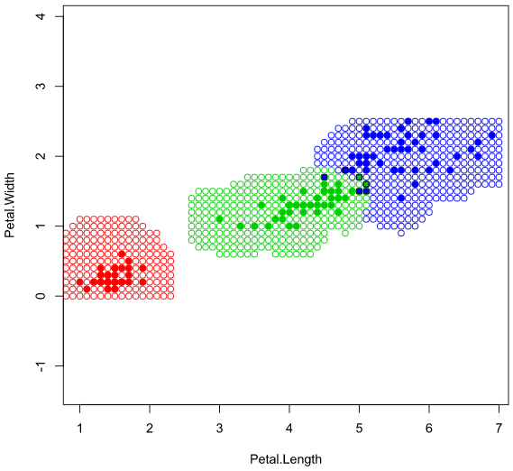

# Метод потенциальных функций

Метод схож с парзеновским окном, однако теперь у каждой точки выборки будет еще свой потенциал. Этот потенциал будет учитываться при подсчете веса точки выборки (умножать на значение ядерной функции).

### Программная реализация на языке R
```R
potentialF <- function(x, z, g, F, h=c()) {
    m <- dim(x)[1]
    n <- dim(x)[2]-1
    if(sum(h) == 0) h <- c(rep(1, m/3), rep(0.25,(m - m / 3)))
    classes <- rep(0, length(names(table(x[,n+1]))))
    names(classes) <- names(table(x[,n+1]))
    for(i in 1:m) {
        y <- x[i, n+1]
        dist <- Distanse(x[i,1:n],z)
        w <- F(dist/h[i]) * g[i]
        classes[y] <- classes[y] + w
    }
    if(sum(classes) > 0) {
        class <- names(which.max(classes))
    } else {
        class <- "unknown"
    }
    return(class)
}
```
### Прямоугольное ядро



### Треугольное ядро



### Ядро Епанечникова



### Квартическое ядро



Преимущества:
<ul>
<li>простота реализации</li>
<li>не требуется сортировка выборки</li>
<li>при правильном подборе h и y будет хорошее качество классификации</li>
<li>большое кол-во параметров, которые можно настраивать</li>
</ul>

Недостатки:
<ul>
<li>если входной объект не попадет в окно с радиусом h, то его не возможно будет проклассифицировать (не используя гауссовское ядро)</li>
<li>требуется хранить полную выборку</li>
</ul>

<a href="https://github.com/davilexx/ml1">На главную</a>
