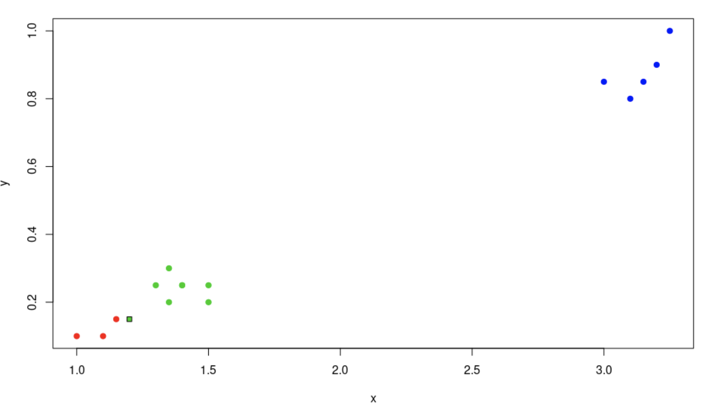
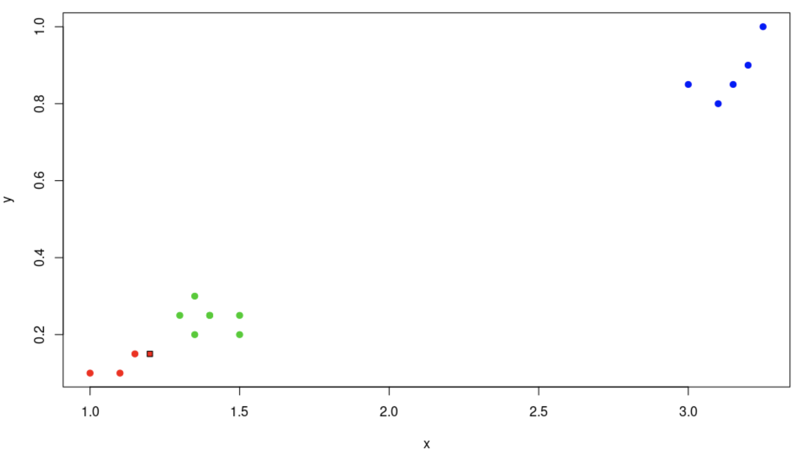

# Сравнение kNN и kWNN

Рассмотрим искуственную выборку с двумя классами и одной входной точкой, которую необходимо проклассифицировать.

На первом графике представлена работа kNN и видно, что метод классифицирует точку ко второму классу. На втором графике работа kWNN и относит точку к первому классу. Таким образом, можно увидеть, что на некоторых выборках kWNN будет работать точнее, чем kNN.

<a href="https://github.com/davilexx/ml1">На главную</a>
